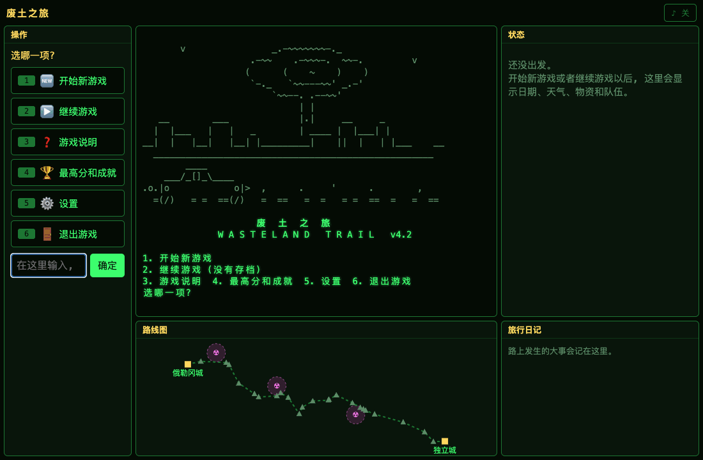

# 废土之旅

一个仿照《俄勒冈之旅》(The Oregon Trail) 的文字冒险游戏。

核战争已经过去二十年了。你被赶出了密苏里州独立城地下的避难所, 要一个人开车沿着当年拓荒者走过的俄勒冈小道, 去 3,119 公里 (1,938 英里) 外的俄勒冈城。



网页版 (v3.1) 的一段游戏画面: 在主菜单继续一局存档, 车停在拉勒米堡 (中间是堡垒的画, 右边是状态, 下面是地图和旅行日记);
点「继续前进」, 车一直往前开, 日期、状态和地图上的车跟着变; 开到北普拉特河边停下来, 点「坐渡船」过了河, 最后停在河边。

## 在线玩

不用下载, 打开就能玩, 电脑和手机都行: https://aizhang453-hash.github.io/wasteland-trail/

第一次打开要下载大约 10 MB (网页里要先装好 Python), 请稍等一会儿; 第一次打开时网页会自动刷新一次, 这是正常的。存档存在浏览器里。

网页版是像原版 CD 版那样的图形界面: 点按钮就能玩, 旁边有状态面板 (日期天气、每个人的健康、物资)、按真实经纬度画的地图 (看得到车走到哪了) 和旅行日记。
电脑、平板、手机都能玩, 会按屏幕大小换摆法: 电脑和平板横着拿是三栏, 手机和平板竖着拿用下面的标签切换「操作 / 状态 / 地图 / 日记」。

网页版也有音乐。浏览器不让网页一打开就出声音, 所以要等你第一次点网页或者按键以后才会响。不想听就点右上角的「♪」按钮, 浏览器会记住。

## 在电脑上运行

需要 Python 3.6 或更高版本, 不用装任何别的东西。

1. 在 [Releases](https://github.com/aizhang453-hash/wasteland-trail/releases) 页面找到最新版本, 下载 **Source code (zip)**, 解压
2. 打开终端 (Mac 叫「终端」, Windows 叫「命令提示符」或「PowerShell」), 进入解压出来的文件夹
3. 输入下面的命令开始玩:

Mac / Linux:

```bash
python3 wasteland_trail.py
```

Windows:

```bash
python wasteland_trail.py
```

Windows 电脑如果提示找不到 python, 要先去 [python.org](https://www.python.org/downloads/) 下载安装, 安装时记得勾选「Add Python to PATH」。

打开以后是开始界面, 在主菜单里选「开始新游戏」。第一次玩可以先看看「游戏说明」。

小提示: 打猎时用方向键移动准星、空格开枪。想用 W A S D 移动的话, 先把输入法切换成英文。

游戏有音乐, 放在 music 文件夹里, 要跟 wasteland_trail.py 放在一起 (下载整个压缩包就行)。
不想听: 用记事本 (Mac 用「文本编辑」) 打开 wasteland_trail.py, 把开头「游戏设置」里的 `MUSIC = True` 改成 `MUSIC = False`。

## 网页版和电脑版有什么不一样

从 v3.0 开始, 网页版和电脑版是两种不同的玩法: 网页版是能点按钮的图形界面, 电脑版是在终端里按键的文字版。
游戏本身是同一份: 规则、路线、天气、事件、难度和得分都一样, 只是样子和操作不一样。

| | 网页版 | 电脑版 |
|---|---|---|
| 怎么打开 | 打开网址就能玩, 不用装东西 (要联网, 第一次要下载大约 10 MB) | 下载游戏, 装好 Python, 在终端里运行 |
| 在哪里玩 | 电脑、平板、手机的浏览器 | Mac、Windows、Linux 电脑的终端 |
| 怎么操作 | 用鼠标或手指点按钮 (也可以打数字) | 按数字键和回车 |
| 打猎 | 用鼠标或手指点一下屏幕上的动物就开枪 (电脑上也可以用方向键和空格) | 方向键 (或 W A S D) 移动准星, 空格开枪 |
| 画面 | 图形界面: 按钮、状态面板 (每个人都有健康条)、按真实经纬度画的地图、可以往上翻的旅行日记; 中间的屏幕放字符画动画和路上发生的事。电脑、平板、手机各有自己的摆法 | 全是文字和字符画。窗口够大 (101 列、28 行以上) 时用分成几块的「大画面」: 动画、状态、字符画的路线图、最近的事; 窗口小就一个画面一个画面地换 |
| 车一直往前开时怎么停 | 点「停下来」, 或者点一下屏幕、按回车 | 按回车 |
| 存档和最高分 | 存在这个浏览器里 (清除网站数据就没了, 换个浏览器或者设备也看不到) | 存在游戏文件夹里 (savegame.json 和 highscores.json) |
| 关音乐 | 点右上角的「♪」 | 改游戏设置里的 `MUSIC` (见上面) |
| 有新版本时 | 自动用上最新版 | 要重新下载 |

两边的存档和最高分不通用: 在网页版玩到一半, 不能拿到电脑版接着玩, 反过来也一样。

## 玩法

- 开局先选难度: 简单、普通、困难。越难, 一开始的钱越少, 路上出事、生病越多, 得分也越高
- 开局可以选距离单位: 公里或英里 (气温和重量也跟着用摄氏度/公斤或华氏度/磅)
- 跟原版一样, 出发月份自己选 (3 月到 7 月): 早走天冷, 山里还在下雪, 吃的要多带; 晚走天热, 要多带水, 还会碰上辐射风暴
- 一个人出发。路上每个据点都有一个人愿意跟你走, 带不带由你决定, 队伍最多 4 个人
- 每个愿意加入的人都有职业和特长: 老兵、医生、机械师、猎人、商人、拾荒者。特长只要人还活着就一直有用。加入时会带上自己的口粮, 但多一个人也要多吃多喝。一个人走钱更宽裕, 可生病了没人照顾, 会危险得多
- 出发前在营地买食物、水、燃料、子弹、零件、药品、冬衣和排辐剂, 路上的据点也能补货, 还能把用不上的东西卖掉换钱 (只给一半的价钱)
- 每样东西都有重量, 车最多装 1000 公斤 (人也算在里面), 装不下就拿不了 (用不上的东西随时可以丢掉, 腾出地方)。燃料最重, 要算好在哪里补给。打猎时每人只扛得动 20 公斤肉
- 每天选择: 继续前进、休息、搜刮废墟、打猎、交易、用药 (药品治病治伤, 排辐剂排辐射, 自己选给谁用)、改变口粮或速度、丢东西
- 跟原版一样, 休息可以一次休息好几天 (最多 9 天); 中间有人病倒、去世, 或者吃的喝的没了, 就会停下来让你想办法
- 跟原版一样可以找人交易: 花一天找人换东西, 对方拿出什么、要你的什么都是随机的, 换不换你自己定。停在据点里一定找得到人, 在路上不一定碰得到; 队伍里有商人, 对方会少要一些
- 跟原版一样一个画面一个画面地换, 不是一直往下滚: 看完按回车, 换下一个画面
- 在电脑上玩, 终端窗口够大的时候, 像原版 CD 版那样用一个分成几块的大画面: 动画、状态、路线图 (看得到走到哪了)、最近发生的事
- 选了「继续前进」, 车会像原版那样一直往前开: 动画一直在动, 下面的日期、天气、每个人怎么样、吃的喝的还够几天跟着变。路上出了事就写在动画下面, 看完接着开; 到了地方就停下来; 想自己停就按回车 (网页版点一下屏幕)
- 车有慢、中、快三档: 开得越快越费燃料、越颠簸, 开得越慢路上耗的天数越多
- 每次赶路都会播放一小段字符画动画: 车在废土上往西开, 远处的山和近处的废墟往后退。动画跟着天气变 (黑雨、灰雪、绿色闪电、沙尘暴……), 车窗里能看到车上有几个人
- 过河、坐木筏也有动画; 走到每个地标和据点都有一幅那里的字符画; 每个队友都有自己的样子; 有人去世会立墓碑, 结局也有画面
- 音乐: 老式游戏机那种「哔哔」声的音乐, 主菜单、赶路、到了据点、开进辐射热点、有人去世、到达终点、全军覆没, 各放各的。赶路时放的是 1848 年拓荒者一路上唱的《哦! 苏珊娜》, 有人去世时吹《熄灯号》
- 彩色界面: 危险的事是红的, 地名是青的, 健康好坏一看颜色就知道; 状态栏有路程进度条, 每个人都有健康条
- 路线和距离按 1847 年拓荒指南里的真实路程表: 路上会经过烟囱岩、独立岩、南山口等 17 个真实地标, 还有卡尼堡、拉勒米堡等 6 个当年的贸易站和军事堡垒可以补给。状态栏会显示下一站还有多远
- 天气按走到哪里、几月份来变: 沿路分成大平原、落基山区、蛇河平原、胡德山等 7 个气候区, 每个地方每个月有多热、几天下雨下雪, 都按当地气象站的真实平均数据。只不过核战争以后, 下的是黑雨、酸雨和灰雪, 天热时还会刮起天空发绿的辐射风暴, 另外还有毒雾和辐射沙尘暴。天热要多喝水, 天冷要多吃东西、穿冬衣; 坏天气会让车开得慢, 暴风雪里车根本开不动, 待在外面还会受伤
- 每个人都有辐射值: 辐射风暴、黑雨这些天气会让辐射越积越多, 高了每天掉血, 只有排辐剂能排掉
- 路上有 3 段辐射热点 (靠近真实的核设施: 导弹发射井、爱达荷国家实验室、汉福德核基地), 在那里每天都要多受辐射。状态栏会提前提醒
- 队员会生病受伤, 一病好几天: 没有干净的水和疫苗, 痢疾、霍乱、伤寒、肺炎这些老病又回来了; 还会被咬伤感染、踩雷骨折、得破伤风、累倒。休息能好得快一些, 药品能马上治好
- 跟原版一样要过河: 路上有 5 条大河, 水浅可以直接开过去, 水深了就绑上空油桶把车浮过去 (可能翻车), 有的河边可以花钱坐渡船, 也可以在河边等几天, 看水会不会退。春天化雪、刚下过雨, 河水都会涨
- 跟原版一样, 打猎是个瞄准射击的小游戏: 变异野兔、双头鹿、辐射野猪在原野上跑来跑去, 移动准星开枪, 打中了就有肉。一次大约 15 秒, 开一枪用一发子弹, 打多了也只扛得回每人 20 公斤
- 跟原版一样, 到了达尔斯要选最后一段路: 扎木筏顺着哥伦比亚河漂下去 (不要钱、不用燃料, 可是要飞快地躲开急流里的礁石), 或者交过路费, 开车走绕过胡德山的巴洛路
- 路上会遇到劫匪、变异野兽、雷区、陌生人、神秘无线电等随机事件, 还有迷路、车着火、夜里来小偷、被变异响尾蛇咬、路太难走这些倒霉事, 也会碰上废弃的农场、干净的泉水、被扔下的旧车这些好事
- 跟原版一样可以和人说话: 车停在地标、据点这些地方时, 那里的人会告诉你前面的河有多深、有没有渡船, 前面的天气, 下一个据点还有多远, 前面的辐射热点, 还有一些过来人的提醒 (不花时间)
- 随时可以查看队伍 (每天的菜单里选 11): 每个人的健康、病、辐射和特长, 还有食物、水、燃料大概还能撑几天, 冬衣够不够穿
- 旅行日记 (每天的菜单里选 12): 路上发生的大事都会自动记下来, 游戏结束时会把整本日记回顾一遍
- 随时可以存档 (每天的菜单里选 13), 存完可以回到主菜单, 下次打开游戏选「继续游戏」接着玩。一局结束后存档会自动删掉

## 结局

一共有 6 个结局: 完美结局、独行结局、普通结局、孤独结局、全军覆没, 还有一个很难触发的隐藏结局。

走到俄勒冈城才算分: 活下来的人越多、越健康, 分越高, 剩下的物资和钱也能换成分。主菜单的「最高分」里记着前 10 名 (网页版记在浏览器里)。

## 参与开发

欢迎在 [Issues](https://github.com/aizhang453-hash/wasteland-trail/issues) 提 bug、提建议。

这不是开源项目, 许可证不允许自己修改代码 (见下面的「许可证」)。想帮忙改代码, 请先开一个 Issue 跟作者商量, 得到同意后再动手, 具体看 [贡献指南](CONTRIBUTING.md)。

## 许可证

本项目使用标准的 [PolyForm Strict License 1.0.0](LICENSE)。简单来说 (以英文原文为准):

- 可以: 非商业用途, 比如下载来自己玩、自己学习研究
- 不可以: 修改代码或内容、在它的基础上做新作品、转发或再发布、拿去商用

想做"不可以"里的事, 请先在 [Issues](https://github.com/aizhang453-hash/wasteland-trail/issues) 联系作者, 拿到许可再说。

v1.5 及以前的版本是按 MIT 许可证发布的, 那些版本仍然适用 MIT。
